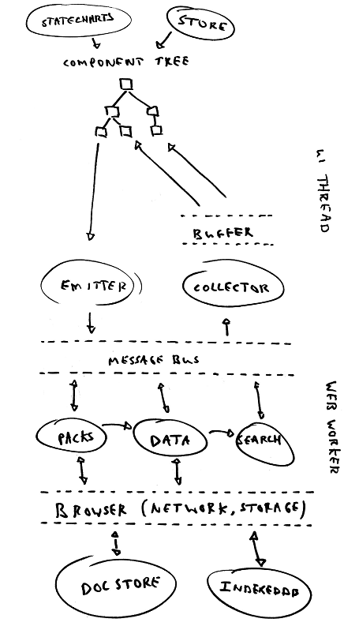

# Rationale

## Current issues

1. Data calculation is chunked because JavaScript is single treaded, hence the resulting code is more complicated and slower.
2. Data retrieval is duplicated because rendering is sync. The data is prepared and cached or stored in various ways. When rendering data is taken from cache or Store.
3. The data preperation steps are not on demand leading to a lot of accidental state and logic.
4. UI and data are coupled through transitions due to having preperation steps.

## Target architecture



From top to bottom, we have **Store** (essential state) and **statecharts** (accidental logic) dictating what is displayed. The resulting **component tree** drives data requirements by calling the relevant **collector** functions. **Buffer** maps between async when walking the tree, and sync when rendering. **Emitter** sends updates to the data layer.

Both **collector** and **emitter** use the **message bus** to communicate with the data layer. **Packs**, **data** and **search** are examples of data services, they might have dependencies. Data services could have caching to avoid repeated requests and expensive calculations. The data layer uses the **browser** interface to exchange data with **DocStore** and **IndexedDB** for instance.

Main points of this architecture:

- All data flow happens async making the code much more uniform
- The data can now be collected on demand, eliminating transitions and accidental logic
- Elimination of the transition decouples UI from data layer
- Elimination of transisions also avoids need to pass temporary values using Store
- Elimination of the logic means caching can now be mechanical
- Mechanical caching greatly reduces accidental state
- Async data flow enables the use of a web worker
- Due to data on demand and web worker exporting becomes much simpler

## Async rendering

React doesn't support async rendering, i.e. ideally we'd write

```jsx
const Pack = async function(id) {
  const pack = await getPack(id) // getPack returns Promise

  return <h2>{pack.name}</h2>
}
```

We could use Suspense and Concurrent (although Concurrent is experimental)

```jsx
const Pack = id => {
  const pack = getPack(id) // could throw Promise

  return <h2>{pack.name}</h2>
}

const App = id => (
  <React.Suspense>
    <React.unstable_ConcurrentMode>
      <Pack id={id} />
    </React.unstable_ConcurrentMode>
  </React.Suspense>
)
```

The disadvantages are:

- the Promises are executed in parallel. Not OK because of our rotating token
- concurrent mode will commit the DOM after some timeout (500ms I think) which will cause flickering
- we don't know when rendering is done, when to handle actions encoding side effect

So we use a tree walker to handle the async data collection

## Relying on `throw` directly

For easy of reading

```jsx
const Pack = id => {
  const pack = getPack(id) // could throw Promise

  return <h2>{pack.name}</h2>
}
```

Note this requires `getPack` to be memoized and to throw on cache miss.

A more elegant but verbose structure would read

```jsx
const Pack = Async(
  props => [props.id], // select arguments
  getPack, // function returning Task
  ({ asyncData: pack, id }) => <h2>{pack.name}</h2>
)
```

Here `Async` does the memoization. The advantage is that the resulting wrapped component could be inspected for async data (i.e. `getPack` returning a `Task`) without calling the render function. On the other hand, the render function needs to be called anyway to discover async data of children.

## Caching strategies

In order of preference:

- Clear all caches on closing pack (except maybe whoami and list of packs)
- Limit number of slots in cache based on (global) parameters, such as `packID`
- Clear caches if memory usage goes above MM. Note: Can we get memory usage of webworker?
- Destroy cache items based on last used date.
- Limit number of slots in cache to N

## Migration

- separate progress bar from main render tree. Needed before we can render async.
- introduce async rendering (interlace using timeouts in memo). Note: this will expose transitions within transitions
- change steps to (uniformly) cache data, not store it, using primitive from Store (e.g. `id`, `key`). This removes accidental state.
  - define data layer function signatures
  - create data layer api, feeding off of Store
  - repoint components to api
  - reimplement api using direct calls
- nibble away steps in reverse order. This removes transitions. All data is now on demand.
- move to webworker. Requires repackaging using webpack, but will give performance boost.
- remove chunking. Another performance boost.

## Bibliography

1. [No silver bullet](http://faculty.salisbury.edu/~xswang/Research/Papers/SERelated/no-silver-bullet.pdf) - _Frederick P. Brooks, Jr._, 1986
2. [Out of the tar pit](https://github.com/papers-we-love/papers-we-love/blob/master/design/out-of-the-tar-pit.pdf) - _Ben Mosely, Peter Marks_, 2006
3. [How did Spotify make a multiplatform, lightweight, well-designed desktop application? What is the technology behind it?](https://www.quora.com/How-did-Spotify-make-a-multiplatform-lightweight-well-designed-desktop-application-What-is-the-technology-behind-it) - _Andreas Blixt_, 2015
